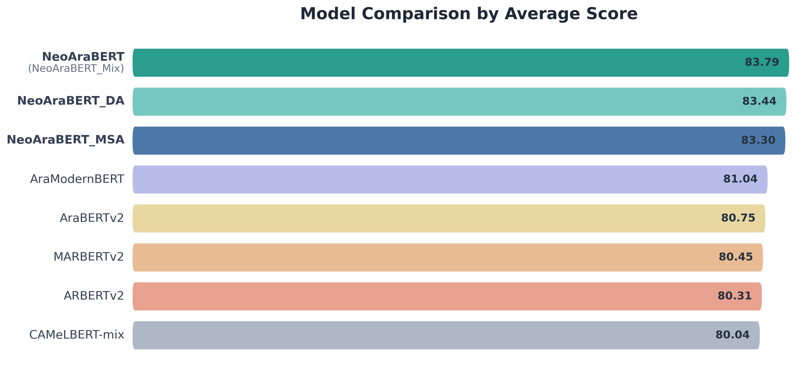

# NeoAraBERT

<p align="center">
  
  &nbsp;&nbsp;&nbsp;&nbsp;
  
</p>

NeoAraBERT is a state-of-the-art open-source Arabic text-embedding model built on the NeoBERT architecture. This project was a collaboration between the Arab Center for Research and Policy Studies' (ACRPS) Unit for Research In Arabic Social and Digital Spaces (U4RASD) and the American University of Beirut (AUB).

We pretrain NeoAraBERT on diverse open-source and internal datasets covering modern standard, classical, and dialectal Arabic. We guided our design choices with Arabic tailored ablation studies including text normalization, light stemming, and diacritics-aware tokenization handling. We also performed POS-aware token masking and learning-rate scheduling ablation studies. We benchmarked NeoAraBERT against five top-performing Arabic models on 23 tasks, including a synonym-based task, [Muradif](https://acr.ps/muradif), that directly assesses embedding quality with no additional fine-tuning. NeoAraBERT variants rank first in 18 tasks and improve average performance across the full benchmark suite.

NeoAraBERT was introduced at the 64th Annual Meeting of the Association for Computational Linguistics (ACL 2026). For more information, visit our website: https://acr.ps/neoarabert.

The available NeoAraBERT checkpoints:

| Model | Description | Link |
|---|---|---|
| NeoAraBERT (NeoAraBERT_Mix) | Trained on both Modern Standard Arabic and Dialectal Arabic. | [link](https://acr.ps/hBya0RM) |
| NeoAraBERT_MSA | Trained on Modern Standard Arabic. | [link](https://acr.ps/hBya0ws) |
| NeoAraBERT_DA | Trained on Dialectal Arabic. | [link](https://acr.ps/hBya0H7) |

<p align="left">
  
</p>

For detailed benchmarking, see https://acr.ps/neoarabert.

## Installation

Prerequisite: install [`uv`](https://docs.astral.sh/uv/getting-started/installation/) first.

```bash
git clone https://github.com/U4RASD/NeoAraBERT.git
cd NeoAraBERT
uv venv --python 3.11
source .venv/bin/activate
uv sync
```


## Training run

```bash
python scripts/run_pipeline.py --config conf/neoarabert.yaml
```

See `conf/neoarabert.yaml` for the full example config. Fields have inline comments explaining what they are used for. The POS-targeted masking will be added later.

## Loading the trained model

After the pipeline finishes, the model directory is a self-contained HuggingFace bundle:

```python
from transformers import AutoModel, AutoTokenizer

path = "NeoAraBERT-<experiment_name>"
tokenizer = AutoTokenizer.from_pretrained(path, trust_remote_code=True)
model = AutoModel.from_pretrained(path, trust_remote_code=True)

inputs = tokenizer("المركز العربيّ للأبحاث ودراسة السياسات.", return_tensors="pt")
embedding = model(**inputs).last_hidden_state[:, 0, :]
```

<details>
<summary>Standard pip installation (Python 3.11 or above)</summary>

```bash
git clone https://github.com/U4RASD/NeoAraBERT.git
cd NeoAraBERT
python -m venv .venv
source .venv/bin/activate
pip install -e .
```

</details>

## Citation

If you use the code, model, or the Muradif benchmark, please cite:

```bibtex
@inproceedings{abou-chakra-etal-2026-neoarabert,
  title = "{NeoAraBERT}: A Modern Foundation Model for Arabic Embeddings with Diacritics-Aware Tokenization and POS-Targeted Masking",
  author = "Abou Chakra, Chadi and
            Hamoud, Hadi and
            Rakan Al Mraikhat, Osama and
            Abu Obaida, Qusai and
            Ballout, Mohamad and
            Zaraket, Fadi A.",
  booktitle = "Findings of the Association for Computational Linguistics: ACL 2026",
  address = "San Diego, California, United States",
  year = "2026",
  note = "Accepted paper",
  url = "https://acr.ps/neoarabert",
  abstract = {We present NeoAraBERT, a state-of-the-art open-source Arabic text-embedding model built on the NeoBERT architecture. We pre-train NeoAraBERT on diverse open-source and internal datasets covering modern standard, classical, and dialectal Arabic. We guided our design choices with Arabic tailored ablation studies including text normalization, light stemming, and diacritics-aware tokenization handling. We also performed more general POS-aware token masking and learning-rate scheduling ablation studies. We benchmarked NeoAraBERT against five top-performing Arabic models on 23 tasks, including a novel synonym-based task, ``Muradif'', that directly assesses embedding quality with no additional fine-tuning. NeoAraBERT variants (MSA, dialectal, and mixed) rank first in 18 tasks, second in two, third in two, and fourth in one task. They show strong performance on classical and modern standard Arabic, substantial margins of improvement ($>$7\%) in two tasks, and a $+$2.75\% improvement on average across all tasks. Our code and links to checkpoints for our model variants are available on our website: \url{https://acr.ps/neoarabert}}
}
```

## Acknowledgements

We would like to acknowledge Ahmad Talal Salman from Assafir and Professor Amer Abdo Mouawad from the American University of Beirut for sharing Assafir data, which was instrumental to the work presented in this paper.

## License

This model is licensed under the CC BY-SA 4.0 license. The text of the license can be found [here](https://creativecommons.org/licenses/by-sa/4.0/).
